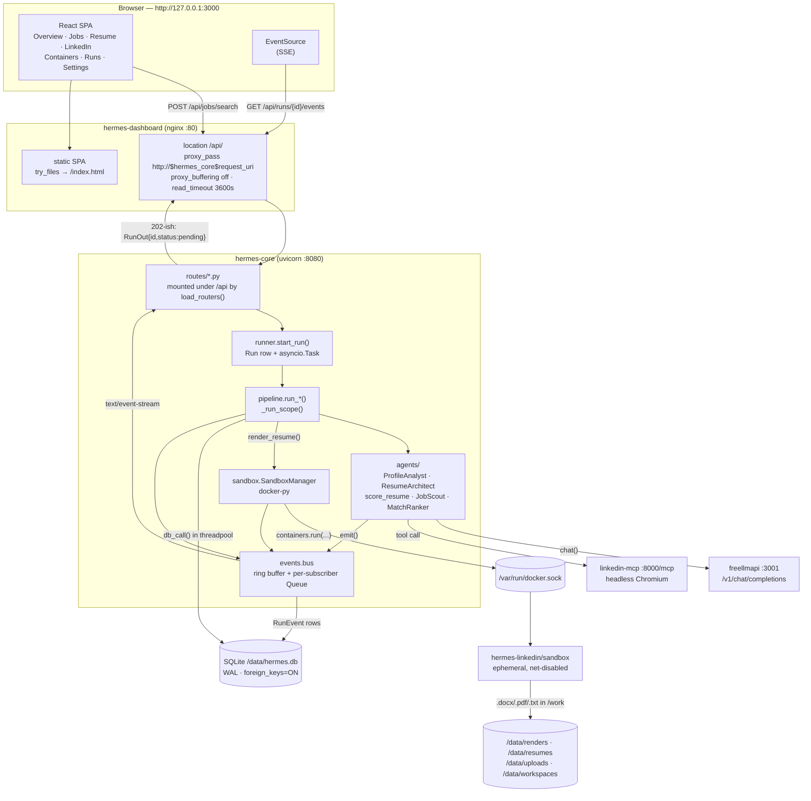

# Hermes — Architecture

Hermes is a single-user, self-hosted stack that reads your LinkedIn profile,
rewrites your resume for ATS parseability, scouts and ranks jobs, and hands you
an apply link. **It never submits an application.** The upstream MCP server
exposes no apply tool and Hermes adds none; see
[LICENSE-NOTICE.md](../LICENSE-NOTICE.md#design-consequence-hermes-never-auto-submits-an-application).

Compose project name: **`hermes-linkedin`** (pinned by `name:` in
`docker-compose.yml`). Named volumes are therefore
`hermes-linkedin_hermes-data`, `hermes-linkedin_freellmapi-data`,
`hermes-linkedin_linkedin-session`.

---

## 1. Services

| Service | Image | Port (host) | Role |
|---|---|---|---|
| `freellmapi` | `ghcr.io/tashfeenahmed/freellmapi:latest` | `3001` | OpenAI-compatible router stacking ~34 free provider tiers behind one client token, with failover. Owns all provider keys. |
| `linkedin-mcp` | `stickerdaniel/linkedin-mcp-server:4.23.2` | none | 19 LinkedIn tools over MCP streamable-http at `:8000/mcp`, driving a real headless Chromium logged into your account. |
| `linkedin-login` | same image, profile `login` | `6080` | One-shot interactive sign-in with a noVNC viewer. Human-only. |
| `hermes-core` | built, `hermes-core:latest` | `8080` | FastAPI orchestrator: 29 API paths under `/api`, SQLite, agents, run/SSE bus, sandbox manager. |
| `hermes-dashboard` | built, `hermes-dashboard:latest` | `3000` | React + Vite + TS behind nginx; proxies `/api` to `hermes-core`. |
| `hermes-sandbox-image` | built, `hermes-linkedin/sandbox:latest`, profile `build-only` | n/a | Not a service. Produces the image `hermes-core` spawns per render/exec job. |

All ports bind to `${HOST_BIND}` = `127.0.0.1` by default. There is no
authentication in front of anything.

The API surface is **29 distinct paths / 31 `(method, path)` operations** —
`/api/jobs/{job_id}` serves `GET` and `PATCH`, and `/api/settings` serves `GET`
and `PUT`.

---

## 2. Request and data flow



### The walk, step by step

1. **Browser → nginx.** The SPA is served from `/usr/share/nginx/html` with an
   `index.html` fallback so `/jobs` survives a hard refresh. Everything under
   `/api/` is reverse-proxied.
2. **nginx → hermes-core.** `proxy_pass http://$hermes_core$request_uri` uses a
   *variable* upstream so nginx resolves `hermes-core:8080` through Docker's
   embedded DNS (`resolver 127.0.0.11 valid=10s`) at request time — nginx boots
   even when core is down, and picks up a new container IP after a recreate.
   SSE survives because `proxy_buffering off`, `proxy_cache off`,
   `chunked_transfer_encoding off`, `Accept-Encoding ""`, `Connection ""`,
   `proxy_http_version 1.1`, and `proxy_read_timeout 3600s`. Core adds
   `X-Accel-Buffering: no` (`routes/_common.SSE_HEADERS`) as belt-and-braces.
   Same-origin proxying is also why CORS is a convenience here, not a
   requirement.
3. **Route handler.** A mutating endpoint does *not* do the work. It validates
   the body (`schemas.py`), calls `runner.start_run(db, kind, params)`, and
   returns a `RunOut` immediately. The only exception is
   `POST /api/sandbox/exec`, which uses `runner.run_and_wait(...)` because its
   contract returns both a Run and the `SandboxResult`.
4. **Runner.** `start_run` inserts a `Run` row (`status="pending"`,
   `params_json`), then `asyncio.create_task(_supervise(kind, run_id, params))`.
   A module-level `_TASKS` set holds a strong reference — without it CPython may
   garbage-collect a live task, which shows up as runs that silently stop
   halfway.
5. **Pipeline.** `pipeline.run_<kind>` wraps its body in `_run_scope`, which
   writes `status="running"`, emits `"<kind>: started"`, and guarantees exactly
   one terminal write. Reusable `_step_*` functions hold the real logic so the
   single-purpose runs and `run_full_pipeline` share one implementation.
6. **Agents.** Thin objects with one public async method each. They never touch
   the DB or HTTP; `pipeline` owns persistence and transactions.
7. **Outbound.** LLM calls go to `freellmapi` only — Hermes holds no provider
   keys. LinkedIn calls go to `linkedin-mcp`, serialised through a semaphore
   (`max_concurrency` default **1**) because there is one browser and one tab;
   concurrent tool calls interleave navigation and corrupt each other's scrapes.
8. **Rendering.** `render.render_resume` injects `services/sandbox/ats_docx.py`
   into a per-run workspace and calls `SandboxManager.run_python`, which asks the
   host daemon for a hardened container. Outputs are copied out of the workspace
   into `$HERMES_DATA_DIR/renders/<basename>-<UTC stamp>/` so
   `Resume.docx_path` / `pdf_path` / `txt_path` stay valid after workspace
   cleanup.
9. **Persistence.** Every DB touch in an async pipeline goes through
   `pipeline.db_call(fn, ...)` → `starlette.run_in_threadpool` → a fresh
   `Session` → commit/rollback/close. Helpers return **detached dicts/scalars**,
   never live ORM instances, because the session is closed by the time the caller
   sees the value.
10. **Events back out.** `bus.publish()` writes a `RunEvent` row *and* fans the
    payload out to live subscriber queues. `GET /api/runs/{id}/events` replays
    persisted history (capped at `_MAX_REPLAY_EVENTS = 500`) then tails the bus.
    `bus.close()` emits a terminal `end` event and pushes a `None` sentinel so
    the generator returns and the HTTP response completes instead of hanging.

### Why runs are async at all

`linkedin-mcp` drives a real browser. Measured behaviour, not estimates:

* a profile scrape is **20–90 s** (up to ~90 s from cold, while Chromium starts
  and the top card loads);
* `search_jobs` with `max_pages=10` **can exceed five minutes**;
* `mcp_client.DEFAULT_TIMEOUT_S = 240` and scales with page count, capped by
  `MAX_TIMEOUT_S = 900`.

No browser wait may sit on a request that a client is blocking on. Hence
`Run` + SSE for everything except trivial reads.

---

## 3. Module map — `services/core/hermes/`

### Foundation

| Module | Job |
|---|---|
| `__init__.py` | Package version only (`__version__ = "1.0.0"`), surfaced as `HERMES_VERSION` and in `GET /api/health`. |
| `settings.py` | Typed `pydantic-settings` view over the environment; **module singleton `settings`** (never construct `Settings()` elsewhere). Owns derived paths (`data_dir`, `db_path`, `workspace_dir`, `resumes_dir`, `uploads_dir`), `effective_docker_host()`, `sandbox_limits()`, `cors_origins`, `linkedin_viewer_url`, and the loud validators `require_llm()` / `require_mcp()`. Also holds the **non-tunable** sandbox invariants (`SANDBOX_PIDS_LIMIT=256`, `cap_drop=["ALL"]`, `no-new-privileges:true`, user `1000:1000`, tmpfs `/tmp size=64m`). If `/data` is unwritable (bare-metal dev on Windows/macOS) it transparently falls back to `<cwd>/data` and remaps sub-paths under it. |
| `db.py` | Engine/session plumbing. **Synchronous SQLite on purpose**: real latency is LLM + scraping, not SQL, and the sync driver works from FastAPI's threadpool and from `asyncio.to_thread`. Per-connection PRAGMAs: `journal_mode=WAL`, `foreign_keys=ON` (off by default in SQLite, so `ondelete=CASCADE` would otherwise be inert), `synchronous=NORMAL`, `busy_timeout=10000`, `temp_store=MEMORY`. Exposes `get_db` (FastAPI dependency), `session_scope()`, `in_thread()`, `init_db()`, `get_setting`/`set_setting`, `healthcheck()`. |
| `models.py` | SQLAlchemy 2.0 ORM. See §4. |
| `schemas.py` | Pydantic v2 request/response models. Ids are strings; datetimes are tz-aware UTC ISO-8601 with `Z`. `*Out.from_model()` classmethods unpack `*_json` columns and are duck-typed via `getattr`, so this module never imports `hermes.models` at runtime (no import cycle). |
| `events.py` | The run event bus. `publish()` is fully synchronous, never blocks (`put_nowait`, dropping the **oldest** item on a full queue), yet returns an already-completed awaitable so both `bus.publish(...)` and `await bus.publish(...)` are legal. Bounded history (`HISTORY_MAXLEN=500`) means a late subscriber gets a replay rather than a blank screen. Cross-thread safe via `loop.call_soon_threadsafe`. `HEARTBEAT_SECONDS=15` emits a `: ping` SSE comment so idle proxies do not close the stream. `MAX_MESSAGE_CHARS=8000` caps what gets persisted. |

### Orchestration

| Module | Job |
|---|---|
| `runner.py` | `start_run` (fire-and-forget) and `run_and_wait` (inline, with timeout). `DISPATCH` maps every `Run.kind` to a pipeline coroutine and an **import-time `assert`** keeps it in sync with the `RUN_KINDS` domain — a typo fails at boot, not when the user clicks a button. Three layers stop a run dying silently: `_run_scope` records the outcome, `_supervise` catches escapes into `Run.error`, `_on_task_done` logs anything both missed. `shutdown_runs()` cancels in-flight tasks on shutdown with a bounded grace so a wedged sandbox cannot block container stop. |
| `pipeline.py` | The seven `run_*` coroutines plus the shared `_step_*` bodies. `PROFILE_SECTIONS = "experience,education,skills,certifications,projects"`. `MAX_RANKED_PER_RUN = 120` caps LLM ranking calls so a 10-page search cannot become 500 free-tier requests. `DEFAULT_RANK_CONCURRENCY = 3`, overridable via the `rank_concurrency` setting, clamped to 1–8. `_upsert_job` is idempotent on `linkedin_job_id` and never clobbers a good stored description with an empty one from a shallower re-scrape. `_SEARCH_KEYS` is the exact set forwarded to `JobScout.search`. |
| `main.py` | ASGI entry point. Startup order is deliberate: logging → `init_db()` (allowed to kill the container; an API with no DB is useless) → routers via `load_routers()` → a configuration banner naming the router and MCP endpoints and listing what the user still has to do. Dependencies are **deliberately not probed** at startup: freellmapi and linkedin-mcp are allowed to be down or logged out, because the page that explains how to fix that must stay reachable. Three exception handlers give the dashboard one JSON envelope (`error`, `detail`, `path`) and never leak a traceback to the browser while always logging one. `docs_url="/api/docs"`. |

### Clients and workers

| Module | Job |
|---|---|
| `llm.py` | `LLMRouter` over the freellmapi OpenAI-compatible surface. Treats transient failure as the *normal* case for free tiers: models discovered from `/v1/models` and cached (`MODEL_CACHE_TTL_S=300`) so a blank `HERMES_MODEL_PRIMARY` still works; a failover chain primary → fallbacks → auto-pick; `MAX_ATTEMPTS_PER_MODEL=3` with exponential backoff + jitter honouring `Retry-After` (seconds *or* HTTP-date, capped at 60 s); a 400 naming an unsupported field (`response_format`, `max_tokens`, `temperature`) triggers payload adaptation and one more attempt rather than burning the model. Nothing streams — Hermes needs whole documents. `extract_json` recovers JSON from fenced/《think》-wrapped model output. |
| `mcp_client.py` | `LinkedInMCP` over MCP streamable-http. Verified against **mcp 2.1.1 + linkedin-mcp-server 4.23.2, protocol 2025-11-25, 19 tools**. Hermes uses five: `get_my_profile`, `get_person_profile`, `search_jobs`, `get_job_details`, `get_saved_jobs`. `search_jobs` params: `keywords` (required), `location`, `max_pages` (1–10), `date_posted`, `job_type`, `experience_level`, `work_type`, `easy_apply`, `sort_by`. **There is no apply/submit tool.** `health()` distinguishes "server unreachable" from "session invalid" by classifying tool-error text against `AUTH_ERROR_MARKERS`, with a 45 s cache. SDK note baked into the file: mcp 1.x's `streamablehttp_client` was renamed `streamable_http_client` with no alias, so the old import silently disabled every LinkedIn call. |
| `sandbox.py` | `SandboxManager`, the docker-py owner. Two jobs: (a) `run_python()` spawns one hardened ephemeral container per job; (b) `list_containers` / `start` / `stop` / `restart` / `remove` / `stats` / `logs` / `logs_stream` back `/api/containers*`. Every blocking SDK call is pushed to a thread. The docker SDK import is **defensive** so `/api/health` can report `docker: false` with a message instead of the API failing to boot. `prune_sandbox_containers()` removes exited containers labelled `hermes.role=sandbox`; `cleanup_workspace(run_id)` deletes a run's workspace and returns bytes freed. Contains the path-translation logic described in §6. |
| `render.py` | Markdown → ATS-safe `.docx` / `.txt` / optional `.pdf`. **Nothing is rendered in the core process.** It injects `ats_docx.py` into the sandbox workspace (falling back to the copy baked at `/opt/hermes/ats_docx.py` in the image), wraps the in-sandbox JSON result in `<<<HERMES_RENDER_JSON>>>` sentinels so LibreOffice's stdout noise cannot corrupt it, then copies artifacts to a durable `renders/` directory. |

### Agents — `hermes/agents/`

| Module | Job |
|---|---|
| `base.py` | `Agent` base class. Rules: exactly one public async method per agent; a `SYSTEM` class attribute so prompts are reviewable and testable in one place; progress via `await self.emit(...)`; LLM output normalised/validated into the contract shape before returning. Agents never touch the DB or HTTP. |
| `profile_analyst.py` | Two passes over the scrape. **Deterministic** (no LLM, no network): employers, titles, date ranges, total years from *merged* employment intervals, skills, education, certifications, a keyword bank. **LLM**: seniority, positioning, domains, soft skills, achievements, gaps, target roles. The LLM answer is merged *over* the deterministic facts, never the reverse; with the router down the analysis still returns, marked `analysis_mode="deterministic"`, because a failed import would block the whole pipeline for an enrichment step. Model-supplied `certifications` are only accepted if actually present in the scraped text. |
| `resume_architect.py` | Writes the canonical single-column ATS-safe Markdown. Section order is imported from `ats.CANONICAL_SECTIONS` rather than restated, so architect, renderer and scorer cannot drift. Anti-fabrication is *enforced*, not just prompted: `build()` re-reads its own output and flags every organisation, year and metric that does not appear in the source material, returning them in `rationale` / `flags`. Hermes does not silently "fix" them — a human decides. |
| `job_scout.py` | Deliberately **LLM-free**: a hallucinated job id produces an apply link that 404s. Normalises every observed `search_jobs` payload shape (bare array, `{"jobs":…}`, `{"results":…}`, `{"items":…}`, single object, two-or-three-level nesting, `{"text":"…"}` when parsing failed) and recovers ids from `urn:li:fsd_jobPosting:…`, `/jobs/view/<id>/` and `?currentJobId=<id>`. |
| `match_ranker.py` | Scores one job against the analysed profile; its output is `Job.match_score`, the column the Jobs page sorts on. The LLM is asked for *evidence* (matched/missing skills, seniority fit) and the arithmetic is done in Python, because a bare model number would make the ordering jitter between runs. Weights: skills `0.45`, semantic `0.35`, remainder for the rest. Verdict bands: `strong ≥78`, `good ≥58`, `stretch ≥38`, else `poor`. Every failure path degrades to deterministic keyword overlap and labels itself as such, so one unrankable job never loses the whole search. |
| `ats.py` | Deterministic ATS scoring. See §5. |

### Routes — `hermes/routes/`

`_common.py` is the shared utility belt (imported by `pipeline.py` too, so there
is exactly one implementation of each helper): serialisers that use
`getattr(obj, name, None)` and never leak `raw_json` or resume markdown into a
*list* response; primary-key coercion (`pk_python_type` / `pk_value` /
`coerce_pk`) so routes stay correct whether ids are ints or UUID strings;
`SSE_HEADERS`; `sse_stream` / `subscribe_iter` shared by `/runs/{id}/events` and
`/containers/{id}/logs`; and `get_setting`/`set_setting`/`all_settings`.

| Module | Paths |
|---|---|
| `health.py` | `GET /health`. Four probes run concurrently, each with its own timeout (`_LLM_TIMEOUT=8`, `_MCP_TIMEOUT=10`, `_DOCKER_TIMEOUT=8`) and its own try/except, so a dead router cannot stop the response reporting that MCP is fine. **`ok` reflects only the database** — otherwise the container HEALTHCHECK would restart-loop merely because you have not logged into LinkedIn yet. |
| `settings.py` | `GET`/`PUT /settings` — the dashboard-editable `Setting` rows plus `settings.config_report()` (non-secret). |
| `llm.py` | `GET /llm/models`, `POST /llm/test`. |
| `linkedin.py` | `GET /linkedin/status`, `POST /linkedin/login`. The status probe runs as a **single background task** with a cached result (`STATUS_TTL_S=45`): a cached answer returns immediately, a probe that finishes inside `_FAST_WAIT_S` returns the real answer (which covers the two cases that fail fast — "not logged in" and "container down"), otherwise it returns `status:"checking"` with HTTP 200 and the next poll gets it. `login_required` is true **only** for a confirmed unauthenticated session, never for "we don't know yet" — that is the flag the UI keys "LinkedIn not connected" off. `POST /linkedin/login` returns *instructions*, starts nothing. |
| `profile.py` | `POST /profile/import`, `GET /profile`. |
| `resume.py` | `POST /resume/upload`, `POST /resume/generate`, `POST /resume/score`, `GET /resumes`, `GET /resumes/{id}`, `GET /resumes/{id}/download`. |
| `jobs.py` | `POST /jobs/search`, `GET /jobs`, `GET`/`PATCH /jobs/{id}`, `POST /jobs/{id}/tailor`. |
| `runs.py` | `GET /runs`, `GET /runs/{id}`, `GET /runs/{id}/events` (SSE). The SSE handler opens its own short-lived sessions rather than taking `Depends(get_db)`, because a dependency session would be held for the whole life of the stream — minutes, on a SQLite pool. |
| `containers.py` | `GET /containers`, `POST /containers/{id}/start|stop|restart`, `DELETE /containers/{id}`, `GET /containers/{id}/stats`, `GET /containers/{id}/logs` (SSE), `POST /sandbox/exec`. Two invariants: Docker is optional (missing socket ⇒ `503` carrying the actual remediation, not `500`), and **Hermes must not kill itself** — stop/restart/remove of `hermes-core` is refused with `409` and the host-side command instead, detected broadly via `/proc/self/cgroup`, `/proc/self/mountinfo`, the hostname, and the pinned `container_name: hermes-core`. |

---

## 4. Database schema

One SQLite file at `$HERMES_DATA_DIR/hermes.db` (`/data/hermes.db`), created
idempotently by `init_db()` → `Base.metadata.create_all`. There are no
migrations; the schema is create-only.

**ID convention:** every primary key is a 32-char lowercase hex UUID4 string
(`new_id()`) **except `RunEvent.id`**, which is an autoincrementing integer
because run events are an append-only log and monotonic ordering is what callers
actually want. So `run_id`, `job_id`, `profile_id`, `resume_id` are all `str` in
the API.

**JSON convention:** every `*_json` column is `Text` holding a JSON string.
Never touch them directly — use the paired `json_prop` object view
(`p.raw = {...}` writes `p.raw_json`; `p.raw` reads it back). Reads are
defensive: `NULL`, blank or corrupt content yields the empty default rather than
raising, so a half-written row can never 500 the dashboard.

### `profile`

`id`, `source` (`linkedin|upload|manual`), `linkedin_username` (indexed),
`headline`, `summary`, `raw_json`, `skills_json`, `experience_json`,
`education_json`, `analysis_json`, `fetched_at` (indexed).
Object views: `raw`, `skills`, `experience`, `education`, `analysis`.
`resumes` relationship cascades delete-orphan, ordered by `version desc`.

### `resume`

`id`, `profile_id` → `profile.id` (`ON DELETE CASCADE`), `version`, `label`,
`target_job_id` → `job.id` (`ON DELETE SET NULL`), `markdown`, `docx_path`,
`pdf_path`, `txt_path`, `ats_score` (indexed), `ats_breakdown_json`,
`created_at`. Index `ix_resume_profile_version (profile_id, version)`.
`has_files` is true when any rendered path is recorded.

### `job`

`id`, `linkedin_job_id` (unique, `uq_job_linkedin_job_id`), `title`, `company`,
`location`, `url`, `easy_apply`, `posted`, `description`, `raw_json`,
`discovered_at`, `match_score` (indexed), `match_breakdown_json`, `status`,
`applied_at`, `notes`, `tailored_resume_id`. Index
`ix_job_status_score (status, match_score)`.

`apply_url` is a property that always yields something usable: the absolute
`url` if present, `https://www.linkedin.com` + a relative `url`, else
`https://www.linkedin.com/jobs/view/<linkedin_job_id>/`.

**The resume ↔ job cycle.** `Resume.target_job_id` is the one real FK.
`Job.tailored_resume_id` is deliberately **not** a `ForeignKey`: the pair forms a
cycle, and SQLite has no `ALTER TABLE ADD CONSTRAINT`, so `create_all()` would
fail with `use_alter=True`. Integrity is maintained in `pipeline.py`. Read it
through the `viewonly` `tailored_resume` relationship; write it through
`tailored_resume_id`.

#### `Job.status` lifecycle

```
                     ┌──────────────► rejected
                     │
new ──► shortlisted ──► tailored ──► applied
                     │
                     └──────────────► skipped
```

Domain: `new | shortlisted | tailored | applied | rejected | skipped`.

* `new` — set on insert by `_upsert_job` when a search discovers the posting.
* `tailored` — set automatically by `pipeline._tailor_top_jobs` when it links a
  tailored resume, and only if the current status is `None`, `""`, `new` or
  `shortlisted`. A human's `rejected` / `skipped` / `applied` triage is never
  overwritten by an automated tailor pass.
* `shortlisted`, `rejected`, `skipped` — human triage, via
  `PATCH /api/jobs/{id}`.
* `applied` — **only ever set by the human** through `PATCH /api/jobs/{id}`.
  The transition into `applied` stamps `applied_at` (once, if it was previously
  something else and `applied_at` is still null). Nothing in Hermes submits an
  application, so nothing else in Hermes writes this value; it is the user
  telling Hermes "I clicked Apply myself".

The transitions above are *conventional*, not enforced: the API validates the
value against the domain and rejects anything else with `422`, but it permits
any value-to-value move, because triage is not a workflow engine.

### `run`

`id`, `kind`, `status`, `params_json`, `result_json`, `error`, `started_at`
(indexed), `finished_at`. `events` and `sandboxes` cascade delete-orphan.
`is_terminal` ⇔ `status in ("done","error")`. `duration_s` normalises naive
SQLite datetimes to UTC before subtracting.

`kind` domain (`RUN_KINDS`, asserted equal to `runner.DISPATCH` at import):
`profile_import`, `resume_build`, `job_search`, `job_tailor`, `ats_score`,
`sandbox_exec`, `full_pipeline`.

`status` domain: `pending → running → done | error`.

### `run_event`

`id` (integer PK, autoincrement), `run_id` → `run.id` (`ON DELETE CASCADE`),
`ts`, `level`, `message`. Index `ix_run_event_run_id_id (run_id, id)` — the
integer PK is a cheap monotonic cursor for SSE replay
(`WHERE run_id=? AND id > last_id ORDER BY id`).
Levels: `debug | info | warn | error | end`.

### `sandbox`

`id`, `container_id` (indexed), `image`, `run_id` → `run.id`
(`ON DELETE CASCADE`), `status`, `exit_code`, `created_at`, `finished_at`,
`limits_json` (a snapshot of `settings.sandbox_limits()`).
Statuses: `created | running | done | timeout | error | killed`.
This is the audit trail: what image ran, under what limits, for which run, and
how it ended.

### `setting`

`key` (PK), `value`, `updated_at` (`onupdate`). Runtime-editable configuration
only — **secrets stay in the environment**. Seeded by `_seed_settings()` without
clobbering user edits: `model_primary`, `model_fallbacks`,
`job_search_keywords`, `job_search_location`, `job_search_easy_apply`,
`job_search_max_pages`, `job_min_score`, `resume_target_pages`,
`llm_temperature`. `pipeline` also reads an unseeded `rank_concurrency`.

---

## 5. Run lifecycle

```
POST /api/jobs/search
   │
   ├─ runner.start_run(db, "job_search", params)
   │     ├─ INSERT run (status="pending", params_json)
   │     ├─ asyncio.create_task(_supervise(...)) ; _TASKS.add(task)
   │     └─ return Run  ──────────────────────────► 200 {id, status:"pending"}
   │
   └─ (background) pipeline.run_job_search(run_id, params)
         └─ _run_scope(run_id, "job_search", body)
               ├─ UPDATE run SET status="running", started_at=now, error=NULL
               ├─ emit "job_search: started"          → RunEvent row + bus
               ├─ body(scope)
               │     ├─ JobScout.search → linkedin-mcp   (minutes)
               │     ├─ _upsert_job × N                   (threadpool)
               │     ├─ MatchRanker.rank × min(N, 120)   (concurrency 1–8)
               │     └─ scope.result = {...}
               ├─ success: UPDATE status="done", result_json, finished_at
               └─ failure: UPDATE status="error", error=<Type: msg>[:4000],
                           result_json = partial scope.result, finished_at
```

Guarantees worth stating plainly:

* **Exactly one terminal write.** `_run_scope` is the only place that sets
  `done` / `error` for a normal run. `_mark_error` (the supervisor's last
  resort) refuses to overwrite an error the pipeline already recorded.
* **Partial results survive failure.** On exception, whatever `scope.result`
  accumulated is still written — for a multi-stage run like `full_pipeline`,
  that is often the only clue about where it died. `run_full_pipeline` records
  each stage into `result["stages"]` as it completes for exactly this reason.
* **Cancellation is a recorded outcome.** `asyncio.CancelledError` writes
  `status="error"` with `"Run cancelled (service shutting down or task
  cancelled)."` and re-raises. On container stop, `shutdown_runs()` cancels
  in-flight tasks so the dashboard does not show a run stuck at `running`
  forever after a restart.
* **A slow browser cannot stall a pipeline.** The bus never blocks the producer;
  a full subscriber queue drops its oldest event.
* **Zero subscribers is normal.** Events are persisted and buffered regardless,
  so opening the Runs page mid-run replays history first.

### ATS scoring

`agents/ats.py` computes a deterministic weighted score, pure Python, no LLM, no
network, no I/O — milliseconds, works offline. `WEIGHTS` sum to exactly 100 and
an `assert` at import enforces it:

| Subscore | Max | What it measures |
|---|---|---|
| `parseability` | 20 | Does the document resolve into recognisable canonical sections at all. |
| `keyword_coverage` | 25 | Does the target job description's vocabulary actually appear. |
| `contact_block` | 10 | Are contact details machine-extractable. |
| `experience_quality` | 20 | Do bullets read as quantified accomplishments rather than duty lists. |
| `formatting` | 15 | Is formatting boring and consistent. |
| `readability` | 10 | Is the prose scannable by a human in six seconds. |

`score_resume()` optionally layers an LLM semantic-fit pass on top and blends
the two numbers. Canonical sections: `PROFESSIONAL SUMMARY`,
`CORE COMPETENCIES`, `PROFESSIONAL EXPERIENCE`, `PROJECTS`, `EDUCATION`,
`CERTIFICATIONS`, `TECHNICAL SKILLS`; `PROJECTS` and `CERTIFICATIONS` are
optional and their absence is not penalised (an empty heading looks worse to a
human than no heading).

**This is a heuristic proxy, not any vendor's parser.** Workday, Greenhouse,
Taleo, iCIMS, SuccessFactors and Lever each parse differently, with undisclosed
and frequently recruiter-configured ranking rules; none publish a score. Treat
the output as actionable feedback ("you are missing these 9 keywords", "31% of
your bullets have no metric"), not as a prediction. **No score guarantees an
interview.**

---

## 6. The route-slot registry

`routes/__init__.py` owns `ROUTE_SLOTS`, a tuple of
`(slot, candidate module names, required, endpoints)`. `main.create_app()` calls
`load_routers()` and mounts each returned router under `/api`. Adding a route
module is one line here, not an edit to `main.py`.

Two deliberate design points:

* **Eager vs. lazy.** `health`, `settings`, `llm`, `linkedin` and `runs` are
  imported eagerly at package load, so `from hermes.routes import health` behaves
  like ordinary attribute access and an import-time syntax error surfaces the
  moment the package loads rather than on the first request. The rest resolve at
  `create_app()` time. A `__getattr__` fallback imports any known candidate on
  first attribute access and, when it does not exist, raises `AttributeError`
  naming *the file* rather than the bare attribute.
* **The candidate tuple.** Each slot accepts several module names
  (`("profile", "profiles")`, `("jobs", "job")`, `("runs", "run")`,
  `("containers", "container")`); the first importable one wins. This exists so a
  singular/plural naming difference between parallel authors cannot take the
  whole API down.

### Why it fails loudly

A half-mounted API is the worst failure mode available here: the dashboard hits
a missing endpoint, gets a `404`, and the symptom looks like a frontend bug three
layers away from the cause. So:

* A **required** slot with no importable candidate raises `RouteModuleError`
  naming the expected file(s), the endpoints that would silently 404 without it,
  and what was tried for each candidate.
* A `ModuleNotFoundError` raised *inside* a route module (a missing dependency)
  is carefully distinguished from "this route file does not exist" by comparing
  `exc.name` against the candidate. Only the latter is a candidate miss; the
  former re-raises as `RouteModuleError` with the explicit note that this is a
  missing dependency inside the module, not a missing file.
* Any other exception during import is re-raised as `RouteModuleError` with the
  exception type and message.
* A module that exists but does not expose a module-level `router: APIRouter`
  raises too, pointing at `health.py` as the established shape.
* Two slots resolving to the same module object are deduplicated by `id()` so a
  router is never mounted twice.
* `main.create_app()` catches `RouteModuleError`, logs it at `CRITICAL`, and
  re-raises — the container refuses to start with a one-line reason.

Only one slot is optional: `sandbox`, because `POST /api/sandbox/exec` may live
in `containers.py` instead of its own module. In this build it does — there is no
`routes/sandbox.py`, and the slot is skipped at `DEBUG` level with no
consequence.

---

## 7. Sandbox threat model

### What runs where

`hermes-core` deliberately does not execute untrusted work in its own process.
LLM-authored Python and document conversion (python-docx, LibreOffice) run in a
short-lived container spawned per job from `hermes-linkedin/sandbox:latest`.

`hermes-core` itself runs as **root inside its container**, and that is a
documented decision rather than an oversight: the Docker socket's group GID
differs per host (Debian ~999/998, Docker Desktop/WSL2 may expose it root:root
0660), so a non-root UID would require baking the host's GID into the image or
relaxing the socket's mode. And anything with socket access is already
root-equivalent on the host, so a non-root UID inside that container buys close
to nothing.

### What each hardening flag buys

Applied unconditionally by `sandbox.SandboxManager.run_python` (invariants live
in `settings.py`; the *image* is built to satisfy them, per the contract block at
the top of `services/sandbox/Dockerfile`):

| Flag | What it buys | What it does **not** buy |
|---|---|---|
| `network_disabled=True` (when `HERMES_SANDBOX_NETWORK=none`) | No exfiltration, no C2, no package installs, no reaching the compose network or the LLM router. The single most valuable flag here. | Nothing about the local filesystem or the kernel. If you set the network to anything else, this protection is simply gone. |
| `mem_limit` (`HERMES_SANDBOX_MEMORY_MB`, default 1024) | A runaway conversion gets OOM-killed instead of swapping the host to death. | It is a *limit*, not isolation: the cgroup accounting is shared with the host kernel. |
| `nano_cpus` (`HERMES_SANDBOX_CPUS`, default 1.0) | No CPU starvation of the rest of the stack. | Nothing about I/O or memory bandwidth. |
| `pids_limit=256` | Fork bombs die at 256 processes. | 256 processes can still saturate the CPU quota. |
| `cap_drop=["ALL"]` | No `CAP_NET_RAW`, `CAP_SYS_ADMIN`, `CAP_DAC_OVERRIDE`, mount, ptrace-of-others, or module loading. Kills most of the classic in-container privilege paths. | Nothing against a kernel LPE that needs no capability, and nothing against a container-runtime bug. |
| `security_opt=["no-new-privileges:true"]` | setuid/setgid binaries and file capabilities cannot raise privilege — `sudo`, `su`, a stray setuid helper are all inert. | It does not remove those binaries; it removes their effect. |
| `read_only=True` (root filesystem) | No persistence, no tampering with the interpreter, the renderer, or `/opt/hermes/ats_docx.py`. Every escape attempt that wants to drop a file has one fewer place to put it. | `/work` and `/tmp` are writable by design — see the next two rows. |
| `tmpfs={"/tmp": "size=64m"}` | A writable scratch area that is RAM-backed, capped, and gone when the container dies. Also why the sandbox image pre-builds the fontconfig cache: at runtime LibreOffice must not need to write into `/usr/share`. | 64 MB of host RAM is consumable. A large intermediate file fails rather than filling a disk. |
| `user="1000:1000"` (uid/gid 1000 exists in the image) | Not root inside the container, so a container-uid-to-host-uid mapping bug is far less interesting. | Without user namespaces, uid 1000 in the container **is** uid 1000 on the host for filesystem purposes. |
| per-run workspace bind-mounted at `/work` | The blast radius of a malicious write is one run's directory, which `cleanup_workspace()` deletes. | The mount is `rw`. Anything in the sandbox can read and rewrite that run's inputs and outputs, including the resume Markdown it was handed. |
| `auto_remove=False` + explicit wait/kill | The exit code, logs and artifacts are collected deterministically, and a `Sandbox` row records image, limits and outcome. Timeout ⇒ killed and recorded as `timeout`. | Exited containers accumulate until `prune_sandbox_containers()` runs. |

What none of these buy, stated plainly: they are **container** boundaries, not
virtualisation. A Linux kernel privilege-escalation bug, or a bug in the
container runtime itself, defeats all of them at once. The sandbox raises the
cost of a successful attack; it does not make one impossible.

### The honest cost of mounting `/var/run/docker.sock`

`docker-compose.yml` bind-mounts the host Docker socket into `hermes-core`. That
is what makes container sandbox mode, resume rendering and the Containers page
work.

**Access to the Docker socket is equivalent to root on the host.** Anything that
can talk to that socket can start a container with `--privileged`, with
`--pid=host`, or with `/` bind-mounted read-write, and from there own the
machine. Therefore:

* A remote-code-execution or SSRF bug in `hermes-core` is a **host compromise**,
  not a container compromise. The sandbox hardening above protects the host from
  the *sandboxed* code; it does nothing to protect the host from `hermes-core`
  itself.
* An escape from the sandbox into `hermes-core` is a full escalation, because
  `hermes-core` holds the socket. Container escape == host root.
* The Containers page can stop, restart and remove **any** container the daemon
  can see, not only Hermes's. `containers.py` refuses to stop/restart/remove
  `hermes-core` itself (`409`), but that is a foot-gun guard, not a security
  boundary.
* Prompt injection is in scope. Hermes feeds LinkedIn page content and job
  descriptions — attacker-influencable text — into LLM prompts whose output is
  then, in the `sandbox_exec` path, executed as Python. The sandbox is what makes
  that acceptable; the socket is what makes it consequential if the sandbox is
  bypassed.

This trade-off is accepted **only** for a single-user, loopback-bound,
self-hosted tool. It is not acceptable for a multi-tenant or internet-exposed
deployment.

Mitigations, in rough order of effort (also listed above the mount in
`docker-compose.yml`):

1. Keep `HOST_BIND=127.0.0.1` (the default). There is no authentication in front
   of any service in this stack.
2. Mount the socket read-only (`:ro`). Read-only views on the Containers page
   keep working; sandbox spawning and the start/stop/remove buttons stop.
3. Put a socket proxy in front of it (e.g. `tecnativa/docker-socket-proxy`
   allow-listing only the endpoints `sandbox.py` needs) and point
   `HERMES_DOCKER_HOST=tcp://docker-socket-proxy:2375` at it.
4. Drop the mount entirely and accept that `/api/sandbox/exec`, resume rendering
   and the Containers page fail loudly (`503` with remediation text).

### Sandbox path translation

`hermes-core` runs inside a container but asks the **host daemon** to create the
sandbox. Bind-mount sources in an API call are resolved by the daemon, not by
`hermes-core`'s filesystem — so binding `/data/workspaces/<run>` naively would
reference a path that exists only inside `hermes-core`. `SandboxManager`
therefore inspects its own container's `Mounts`, builds a
destination → daemon-side `Source` table (longest destination first, so the most
specific mount wins) and rewrites the workspace path. `HERMES_SANDBOX_HOST_WORKSPACE`
overrides the discovery. When `hermes-core` runs directly on the host the path is
used verbatim (Windows paths keep their backslashes). This is why
`HERMES_SANDBOX_WORKSPACE` must stay under `HERMES_DATA_DIR`: the `hermes-data`
volume is what makes the same bytes visible to both sides.

### Labels

Two label namespaces exist and they are not interchangeable:

* Compose services carry `com.hermes.stack=hermes` (from the
  `x-hermes-labels` anchor). No code reads this today.
* Containers **Hermes creates** carry `hermes.project=hermes`,
  `hermes.role=sandbox`, `hermes.run_id=<id>`, `hermes.sandbox_id=<id>`.
  `prune_sandbox_containers()` filters on `hermes.role=sandbox` + `status=exited`.
* `containers.py`'s `is_hermes` flag is true when `hermes.project=hermes` **or**
  `com.docker.compose.project` starts with `hermes` — the latter is what actually
  matches the compose services, since the project is `hermes-linkedin`.

---

## 8. Storage layout

Inside `hermes-core` (volume `hermes-linkedin_hermes-data` at `/data`):

```
/data
├── hermes.db              SQLite (+ -wal, -shm)
├── workspaces/<run_id>/   per-run sandbox workspace, bind-mounted at /work
├── renders/<name>-<UTC>/  durable rendered .docx/.pdf/.txt (render.py)
├── resumes/               resume text sidecars
└── uploads/               user-uploaded base resumes
```

`freellmapi` owns `/app/server/data` (volume `hermes-linkedin_freellmapi-data`):
its local account and your **encrypted** provider keys. The encryption key is
`ENCRYPTION_KEY` from `.env` — 64 hex characters, generated by bootstrap.
Restoring that volume without the matching `ENCRYPTION_KEY` leaves the stored
provider keys undecryptable.

`linkedin-mcp` owns `/home/pwuser/.linkedin-mcp` (volume
`hermes-linkedin_linkedin-session`): the persistent Playwright browser profile,
i.e. your LinkedIn session. It **must** stay a named volume — the upstream image
seeds a fresh named volume from the contents baked into the image, and a host
bind mount skips that seeding and (on Windows) mangles ownership for `pwuser`
(uid 1000), breaking the profile entirely.

That volume is never backed up or restored by `scripts/backup.*` /
`scripts/restore.*`. It is a live authenticated session — cookies, tokens and a
device fingerprint — so copying it between machines is both fragile (fingerprint
mismatch makes LinkedIn more likely to invalidate the session or flag the
account) and a security risk (the files are bearer credentials to your account
in plain form). The supported way to have a session on a machine is to log in on
that machine.

---

## 9. LinkedIn authentication

Login is interactive and human-only, by design.

`make login-linkedin` (or `scripts/linkedin-login.ps1` /
`scripts/linkedin-login.sh`) starts the one-shot `linkedin-login` compose
profile, which runs the MCP image with `--login --login-viewer` and publishes a
noVNC desktop on `LINKEDIN_VIEWER_PORT` (default `6080`). You open
`http://localhost:6080/vnc.html` and sign in with your own hands — email,
password, 2FA code, any captcha or checkpoint. Hermes never types your password,
never handles your 2FA code and never solves captchas. The authenticated profile
lands in the shared `linkedin-session` volume; `make restart` makes the
long-running `linkedin-mcp` service pick it up.

Chromium takes an **exclusive lock** on the profile directory, so the login
container and `linkedin-mcp` cannot both use it. `scripts/linkedin-login.*`
stops `linkedin-mcp` first and restarts it afterwards (`-KeepRunning` /
`-NoRestart` to override).

With no session, every tool call fails with:

> `No valid LinkedIn session is available in Docker. Create one with the explicit --login --login-viewer Docker command, or run --login on the host, then retry this tool.`

`mcp_client.health()` classifies that text as an auth failure rather than
unreachability, `GET /api/linkedin/status` sets `login_required: true`, and the
dashboard shows **"LinkedIn not connected"**.

Job search and the deterministic ATS scorer are the parts that survive an
unconfigured stack; everything LLM-backed needs `FREELLMAPI_KEY`, and everything
LinkedIn-backed needs the session.
